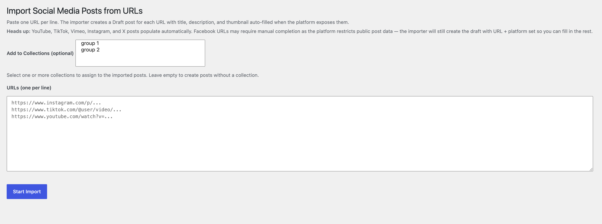

# Social Media Posts for WordPress

**Version:** 1.1.0  
**Requires:** WordPress 6.0+, PHP 7.4+  
**Optional:** Elementor (for Dynamic Tags)

A WordPress plugin that lets you curate social media posts from any platform and display them on your site through shortcodes and Elementor Dynamic Tags.

---

## Features

- **Custom post type** — `Social Media Posts` with full admin UI, REST API support, and archive pages.
- **Collections taxonomy** — group posts into named collections for targeted display.
- **Per-post fields** — platform, source URL, description, author name/handle/bio, and media (WordPress Media Library attachment or external URL).
- **URL importer** — paste one URL per line; drafts are created automatically with title, description, and thumbnail pulled from YouTube, TikTok, Instagram, X, Vimeo, and more via oEmbed.
- **Social Links manager** — a dedicated admin page to configure your social profile URLs and generate a branded icon shortcode.
- **Three display shortcodes** — carousel, grid, and animated wall.
- **Elementor Dynamic Tags** — eight tags for use inside Loop Grid and other Elementor templates.

---

## Supported Platforms

Instagram · Facebook · X (Twitter) · TikTok · YouTube · LinkedIn · Other

---

## Shortcodes

### `[smp_carousel]`

A GSAP-powered horizontal carousel with prev/next arrows.

| Attribute | Default | Description |
|-----------|---------|-------------|
| `limit` | `-1` | Number of posts (`-1` = all) |
| `platform` | _(any)_ | Filter by platform slug (`instagram`, `x`, etc.) |
| `category` | _(any)_ | Filter by collection slug |
| `orderby` | `date` | WordPress `orderby` value |
| `order` | `DESC` | `ASC` or `DESC` |
| `loop` | `true` | Enable infinite loop (`true`/`false`) |
| `visible` | `5` | Cards visible at once (3–5) |

**Example:**
```
[smp_carousel platform="instagram" limit="12" visible="4"]
```

---

### `[smp_grid]`

A responsive CSS grid of post cards.

| Attribute | Default | Description |
|-----------|---------|-------------|
| `limit` | `-1` | Number of posts |
| `platform` | _(any)_ | Filter by platform slug |
| `category` | _(any)_ | Filter by collection slug |
| `columns` | `3` | Column count (1–4) |
| `orderby` | `date` | WordPress `orderby` value |
| `order` | `DESC` | `ASC` or `DESC` |

**Example:**
```
[smp_grid columns="4" category="featured" limit="8"]
```

---

### `[smp_wall]`


A full-bleed animated image mosaic — images shuffle at a configurable interval. Supports enclosed content (overlaid on top of the wall).

| Attribute | Default | Description |
|-----------|---------|-------------|
| `columns` | `8` | Grid columns (2–16), auto-reduced on smaller screens |
| `rows` | `6` | Grid rows (2–16) |
| `gap` | `4` | Gap between tiles in px (0–40) |
| `interval` | `7800` | Swap interval in ms (600–60000) |
| `swaps` | `3` | Tiles swapped per interval (1–30) |
| `opacity` | `1` | Image opacity (0–1) |
| `background` | `#0b0b0b` | Background colour (hex, named, rgb/rgba/hsl) |
| `blur` | `0` | Image blur in px (0–50) |
| `limit` | `-1` | Number of posts to pull from |
| `platform` | _(any)_ | Filter by platform slug |
| `category` | _(any)_ | Filter by collection slug |

**Example — wall with centred overlay text:**
```
[smp_wall columns="10" rows="5" opacity="0.6" blur="2"]
  <h2>Our Community</h2>
[/smp_wall]
```

---

### `[smp_social_links]` _(alias: `[smp_social_icons]`)_

Renders your saved social profile links as branded or minimalist SVG icons. Settings are configured once in **Social Media Posts → Social Links** and can be overridden per shortcode.

| Attribute | Default | Description |
|-----------|---------|-------------|
| `style` | `branded` | `branded` (brand colours) or `minimalist` (line icons) |
| `shape` | `circle` | `circle`, `rounded`, `square`, or `none` |
| `size` | `20` | Icon size in px (8–128) |
| `padding` | `12` | Inner padding in px (0–80) |
| `gap` | `12` | Gap between icons in px (0–80) |
| `color` | _(brand)_ | Icon colour hex; overrides brand colours |
| `bg` | _(brand)_ | Background colour hex |
| `border` | `0` | Border width in px (0–20) |
| `border_color` | _(none)_ | Border colour hex |
| `align` | `left` | `left`, `center`, or `right` |
| `target` | `_blank` | `_blank` or `_self` |
| `only` / `platforms` | _(all)_ | Comma-separated platform slugs to show, in that order |

**Example:**
```
[smp_social_links style="minimalist" shape="circle" size="24" align="center"]
[smp_social_links only="instagram,tiktok,youtube"]
```

Available icon slugs: `instagram` · `facebook` · `x` · `tiktok` · `linkedin` · `youtube` · `website`

---

## Elementor Dynamic Tags

When Elementor is active, eight Dynamic Tags are registered under the **Social Media Posts** group:

| Tag | Field |
|-----|-------|
| Description | `_smp_description` |
| URL | `_smp_url` |
| Image | `_smp_media_attachment_id` / `_smp_media_url` |
| Video | `_smp_media_url` |
| Platform | `_smp_platform` |
| Author Name | `_smp_author_name` |
| Author Handle | `_smp_author_handle` |
| Author Bio | `_smp_author_bio` |

Use these inside an Elementor **Loop Grid** template to build custom social feed layouts.

---

## URL Importer



Go to **Social Media Posts → Import URLs** and paste one social media URL per line. The importer creates a Draft post for each URL, auto-filling the title, description, and thumbnail where the platform exposes them via oEmbed.

**Full auto-fill support:** YouTube, TikTok, Vimeo, Instagram, X  
**Partial support (URL + platform only):** Facebook (platform restricts public post data)

---

## Installation

1. Upload the `social-media-posts` folder to `/wp-content/plugins/`.
2. Activate via **Plugins → Installed Plugins**.
3. Go to **Social Media Posts → Add New** to create your first post.
4. Go to **Social Media Posts → Social Links** to set up your social profile icons.

---

## File Structure

```
social-media-posts/
├── social-media-posts.php      # Plugin bootstrap
├── includes/
│   ├── Plugin.php              # Singleton, boots all components
│   ├── PostType.php            # CPT + taxonomy + meta registration
│   ├── MetaBox.php             # Admin edit screen meta box
│   ├── Ajax.php                # AJAX handlers
│   ├── Importer.php            # URL import admin page
│   ├── BulkActions.php         # Bulk action extensions
│   ├── Carousel.php            # [smp_carousel] shortcode
│   ├── Grid.php                # [smp_grid] shortcode
│   ├── Wall.php                # [smp_wall] shortcode
│   ├── SocialLinks.php         # Social Links manager + [smp_social_links]
│   ├── ElementorTags.php       # Elementor Dynamic Tag registration
│   ├── OEmbedFetcher.php       # oEmbed / URL metadata fetch
│   ├── PostParser.php          # Post content parsing utilities
│   ├── UrlEnricher.php         # URL metadata enrichment
│   └── Tags/                   # Individual Elementor Dynamic Tag classes
│       ├── AuthorBioTag.php
│       ├── AuthorHandleTag.php
│       ├── AuthorNameTag.php
│       ├── DescriptionTag.php
│       ├── ImageTag.php
│       ├── PlatformTag.php
│       ├── UrlTag.php
│       └── VideoTag.php
└── assets/
    ├── carousel.js / carousel.css
    ├── grid.css
    ├── wall.js / wall.css
    ├── social-links.css
    ├── social-links-admin.js
    ├── admin.js / admin.css
    └── import.js / import.css
```

---

## Changelog

### 1.1.0
- New **Social Links** admin page to manage social profile URLs with per-link tab target control.
- New `[smp_social_links]` shortcode (alias `[smp_social_icons]`) with branded/minimalist icon styles, shape, size, colour, background, border, alignment, and `only=` filtering.
- New `[smp_wall]` shortcode — animated image mosaic with configurable columns, rows, swap interval, opacity, blur, and optional overlay content.
- Collections taxonomy added for filtering posts across all shortcodes.

### 1.0.0
- Initial release: `Social Media Posts` CPT, meta box, oEmbed fetch, URL importer, `[smp_carousel]`, `[smp_grid]`, and Elementor Dynamic Tags.
